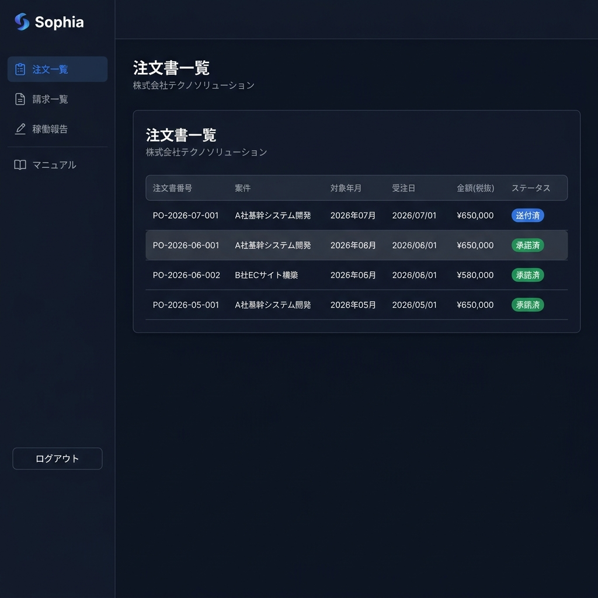
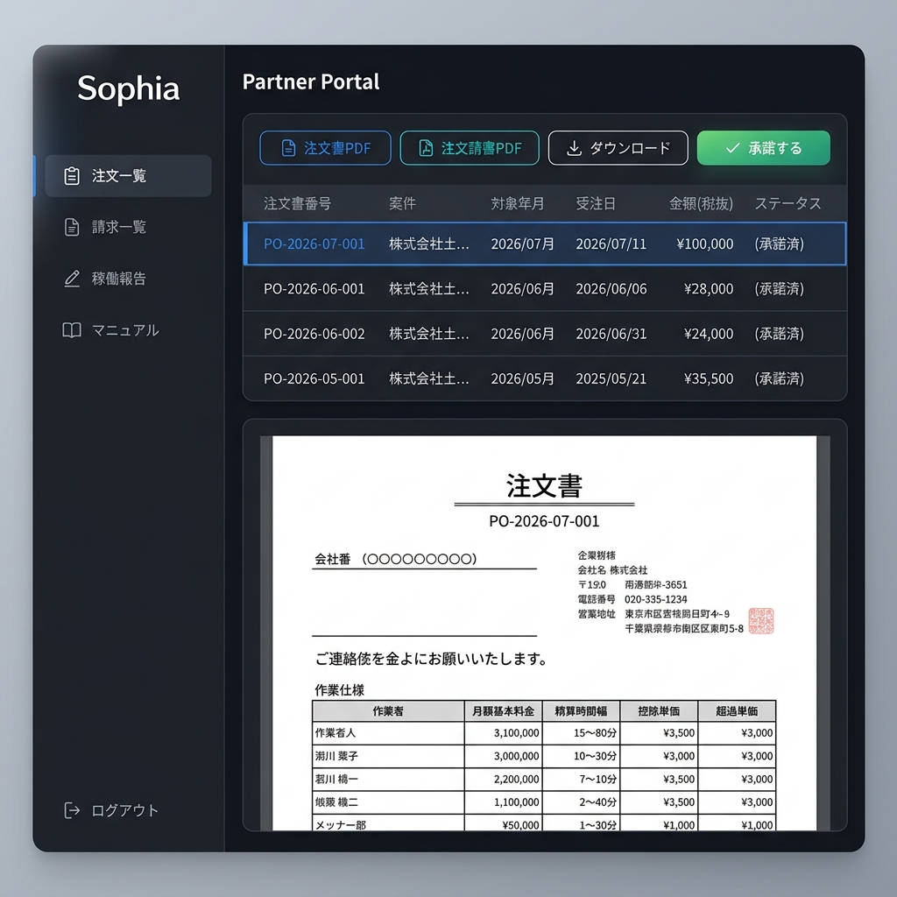
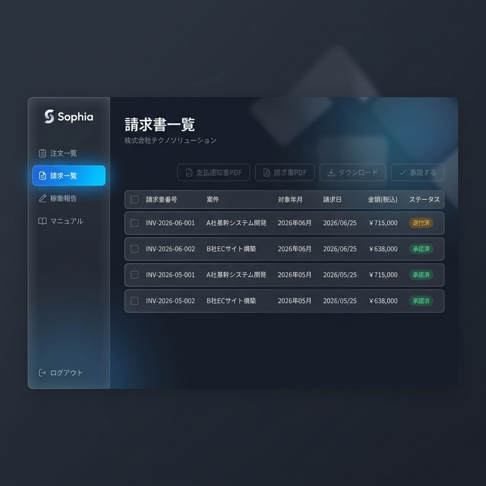
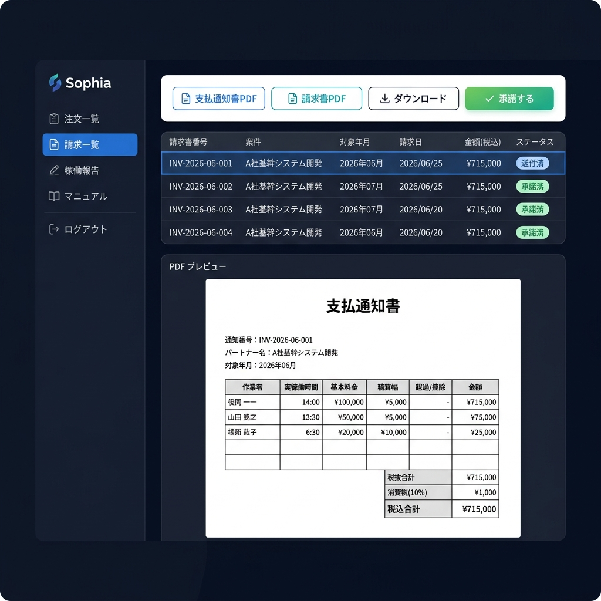
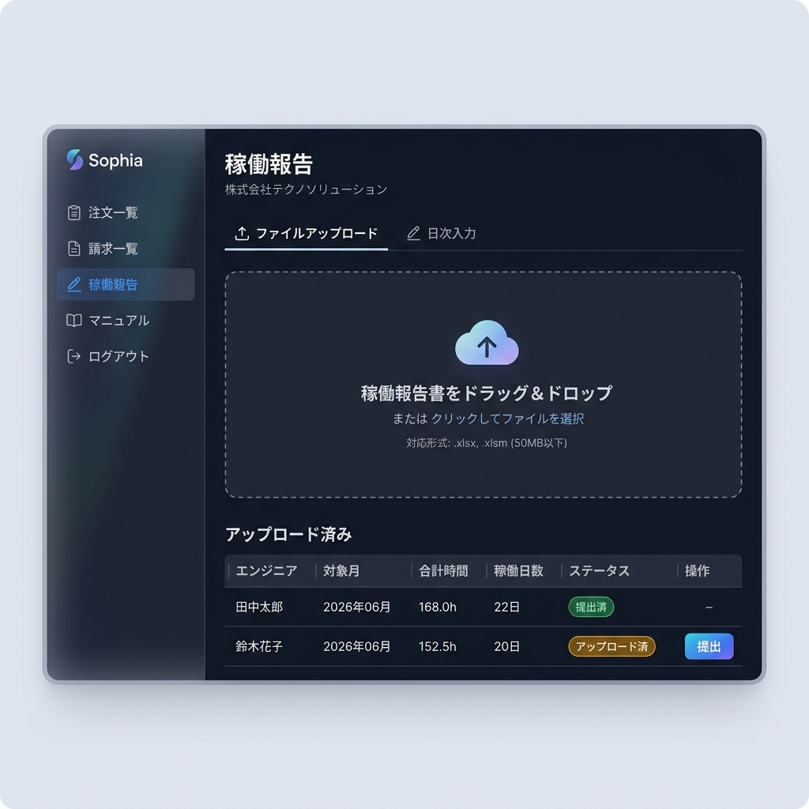
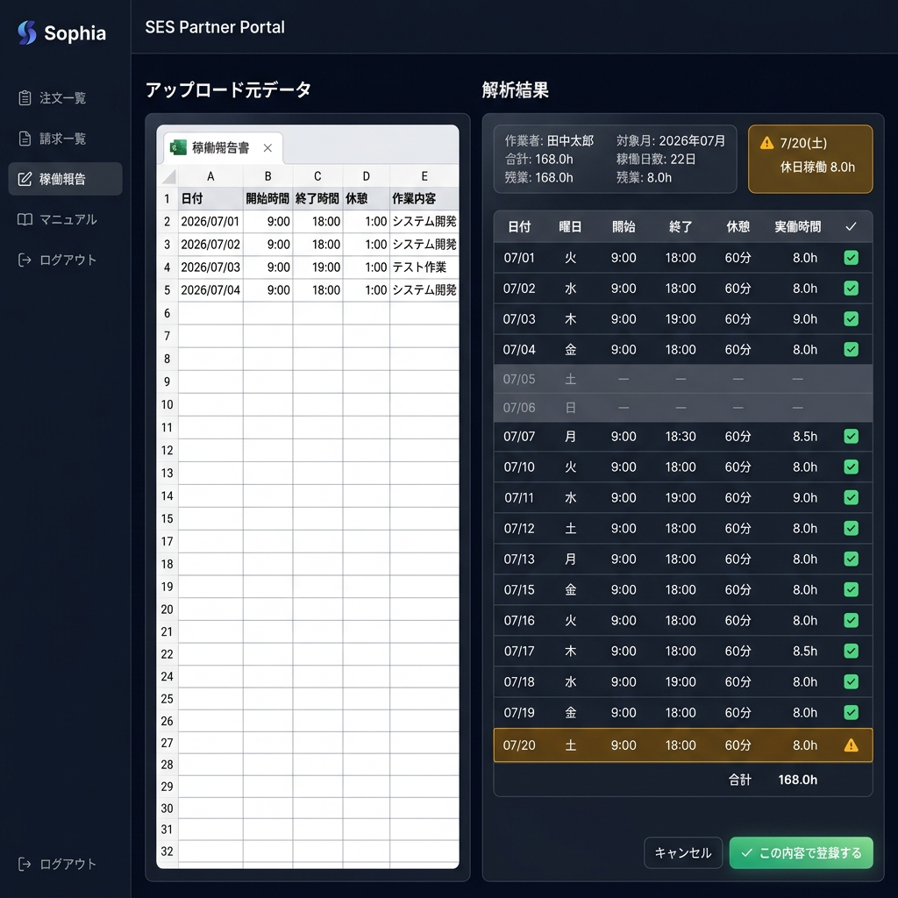

# Sophia パートナーポータル 操作マニュアル

---

## はじめに

本マニュアルは、Sophia パートナーポータルの操作方法について説明します。  
パートナーポータルでは、以下の機能をご利用いただけます。

| メニュー | 概要 |
|:---------|:-----|
| 📋 注文一覧 | 弊社からの注文書の確認・承諾 |
| 📄 請求一覧 | 支払通知書・請求書の確認・承諾 |
| 📝 稼働報告 | 稼働報告書のアップロード・日次入力 |
| 📖 マニュアル | 本マニュアルの表示 |

---

## 1. ログイン方法

1. 弊社からお送りした**ログインURL**（マジックリンク）をクリックします
2. メールに記載のリンクをクリックすると、自動的にポータルにログインされます
3. リンクは一定時間で無効になります。期限切れの場合は弊社担当者にご連絡ください

> **注意**: ログインリンクは1回限り有効です。ブックマークしてもご利用いただけません。

---

## 2. 注文書一覧

弊社からの注文書（発注書）を確認・承諾できます。

#### 注文書一覧画面

#### 注文書を選択した場合

### 画面の見方

| 項目 | 説明 |
|:-----|:-----|
| 注文書番号 | 注文書の管理番号（例: PO-203-0000-0000） |
| 案件 | 業務の案件名 |
| 対象年月 | 注文書の対象となる年月 |
| 受注日 | 弊社が発注した日付 |
| 金額(税抜) | 注文金額（税抜） |
| ステータス | 送付済 / 承諾済 |

### 注文書の確認方法

1. 一覧の中から確認したい注文書の行をクリックします
2. 画面上部にアクションボタンが表示されます
   - **注文書PDF**: 注文書のPDFを表示します
   - **注文請書PDF**: 注文請書のPDFを表示します
   - **ダウンロード**: PDFファイルをダウンロードします
3. 画面下部にPDFのプレビューが表示されます

### 注文書の承諾方法

1. ステータスが「**送付済**」の注文書の行をクリックします
2. **「承諾する」ボタン**をクリックします
3. 確認ダイアログが表示されます。内容をご確認の上「OK」をクリックしてください
4. 承諾が完了すると、ステータスが「**承諾済**」に変わります
5. 弊社担当者に承諾完了の通知が自動送信されます

> **注意**: 一度承諾した注文書は取り消しできません。内容に疑問がある場合は、承諾前に弊社担当者にお問い合わせください。

---

## 3. 請求書一覧

弊社からの支払通知書・請求書を確認・承諾できます。

#### 請求書一覧画面

#### 請求書を選択した場合

### 画面の見方

| 項目 | 説明 |
|:-----|:-----|
| 請求書番号 | 請求書の管理番号（例: INV-203-0000-0000） |
| 案件 | 業務の案件名 |
| 対象年月 | 請求の対象となる年月 |
| 請求日 | 請求書の発行日 |
| 金額(税込) | 請求金額（税込） |
| ステータス | 送付済 / 承諾済 |

### 請求書の確認方法

1. 一覧の中から確認したい請求書の行をクリックします
2. 画面上部にアクションボタンが表示されます
   - **支払通知書PDF**: 支払通知書のPDFを表示します
   - **請求書PDF**: 請求書のPDFを表示します
   - **ダウンロード**: PDFファイルをダウンロードします
3. 画面下部にPDFのプレビューが表示されます

### 請求書の承諾方法

1. ステータスが「**送付済**」の請求書の行をクリックします
2. **「承諾する」ボタン**をクリックします
3. 確認ダイアログで「OK」をクリックします
4. 承諾完了後、ステータスが「**承諾済**」に変わります

> **注意**: 金額や明細に不明な点がある場合は、承諾前に弊社担当者にご確認ください。

---

## 4. 稼働報告

月次の稼働報告書をアップロード、または日次で勤務時間を入力できます。

### 4-1. Excelファイルのアップロード（推奨）

普段お使いの稼働報告書（Excelファイル）をそのままアップロードできます。

#### アップロード画面

1. サイドバーの「**稼働報告**」をクリックします
2. 「**ファイルをアップロード**」エリアにExcelファイルをドラッグ＆ドロップします
   - または「ファイルを選択」ボタンからファイルを指定できます
3. アップロード後、**解析結果の確認画面**が表示されます

#### 確認画面（プレビュー）

#### 確認画面の見方（左右分割表示）

| エリア | 表示内容 |
|:-------|:---------|
| **左パネル** | アップロードしたExcelの元データ（スプレッドシート表示） |
| **右パネル上部** | サマリー（作業者名・対象月・合計時間・稼働日数・残業時間） |
| **右パネル中央** | 日別明細テーブル（日付・曜日・開始・終了・休憩・実働時間） |
| **右パネル下部** | アラート（土日祝稼働など） |

4. **左のExcel元データと右の解析結果を見比べて、正しく読み取れているか確認します**
   - 土日祝の行はグレー表示、休日稼働がある場合はアンバー（黄色）で強調されます
   - サンプル行が誤って取り込まれていないか確認してください
5. 問題なければ「**✅ この内容で登録する**」ボタンをクリックします
6. 「**キャンセル**」をクリックすると、アップロード前の状態に戻ります

> **重要**: 「この内容で登録する」を押すまでデータは保存されません。安心して確認作業を行ってください。

#### 対応ファイル形式

- `.xlsx`（Excel 2007以降）
- `.xlsm`（マクロ付きExcel）

#### 解析される情報

| 項目 | 説明 |
|:-----|:-----|
| 作業者名 | シート内のオートシェイプまたはファイル名から自動取得 |
| 対象月 | 日付データまたはファイル名から自動判別 |
| 日別明細 | 日付・開始時刻・終了時刻・休憩時間・実働時間 |
| 合計稼働時間 | 日別の作業時間を集計 |
| 稼働日数 | 勤務のあった日数をカウント |
| 土日祝稼働 | 土日・祝日の勤務がある場合にアラート表示 |

> **ヒント**: 解析エラーが発生する場合は、ファイル名に「`作業者名_YYYYMM`」を含めると正しく認識されやすくなります。  
> 例: `田中太郎_202607.xlsx`

### 4-2. 日次入力

Excelファイルがない場合は、画面から直接勤務時間を入力できます。

1. 「**日次入力**」タブをクリックします
2. 対象月とエンジニアを選択します
3. カレンダー形式で各日の開始時刻・終了時刻・休憩時間を入力します
4. 入力内容は自動保存されます
5. 全日程の入力が完了したら「**提出**」ボタンをクリックします

---

## 5. よくある質問（FAQ）

### Q: ログインリンクの期限が切れました
**A:** 弊社担当者にご連絡ください。新しいログインリンクをお送りいたします。

### Q: 注文書の承諾を取り消したい
**A:** システム上での取り消しはできません。弊社担当者にご連絡ください。

### Q: 稼働報告書のアップロードでエラーが出る
**A:** 以下をご確認ください:
- ファイル形式が `.xlsx` または `.xlsm` であること
- ファイルが破損していないこと
- シート内に日付と作業時間のデータがあること
- ファイルサイズが50MB以下であること

### Q: パスワードを忘れました
**A:** 本システムはパスワード不要（マジックリンク方式）です。ログインリンクは弊社担当者から送付されます。

---

## お問い合わせ

ご不明な点がございましたら、弊社担当者までご連絡ください。

---

*最終更新: 2026年7月*
