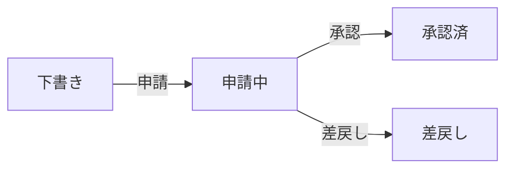

# 経費申請 操作マニュアル

## 概要

社員が発生した経費（交通費、食費、消耗品等）を申請し、管理者が承認・差戻しを行う機能です。

## アクセス方法

サイドメニューの **給与** セクション → **経費** からアクセスします。

または、ブラウザで直接以下のURLにアクセスできます：

| 画面 | URL |
|------|-----|
| 経費申請一覧 | `/expenses` |
| 新規申請 | `/expenses/new` |
| 申請詳細 | `/expenses/{id}` |

> [!NOTE]
> STAFF権限（管理者）のみアクセス可能です。

---

## ステータス遷移

| ステータス | 説明 | バッジ色 |
|:---|:---|:---|
| 下書き（DRAFT） | 作成直後。まだ上長に提出されていない | グレー |
| 申請中（SUBMITTED） | 上長の承認待ち | 青 |
| 承認済（APPROVED） | 承認完了 | 緑 |
| 差戻し（REJECTED） | 内容に不備あり。修正が必要 | 赤 |

---

## 操作手順

### 1. 新規経費申請の作成

1. 経費申請一覧画面で右上の **「＋ 新規申請」** ボタンをクリック
2. 以下の項目を入力：

| 項目 | 必須 | 説明 |
|:---|:---:|:---|
| 社員 | ✅ | 経費を申請する社員をプルダウンから選択 |
| 経費日 | ✅ | 経費が発生した日付（カレンダーから選択） |
| カテゴリ | ✅ | 下記7種から選択 |
| 金額 | ✅ | 経費金額（円、1円以上の整数） |
| 説明 | — | 経費の用途・詳細を記入（任意） |

3. **「登録」** ボタンをクリック → 詳細画面に遷移

> [!TIP]
> 登録直後は「下書き」ステータスです。この段階ではまだ申請されていません。

### 2. 申請の提出

1. 詳細画面で内容を確認
2. 右側アクションパネルの **「申請」** ボタンをクリック
3. ステータスが **「申請中」** に変更される

### 3. 申請の承認（管理者）

1. 経費申請一覧でステータスが **「申請中」** の申請を確認
2. IDをクリックして詳細画面を開く
3. 右側アクションパネルで **「承認」** または **「差戻し」** をクリック

| ボタン | 動作 |
|:---|:---|
| ✅ 承認 | ステータスを「承認済」に変更 |
| ↩ 差戻し | ステータスを「差戻し」に変更 |

---

## 経費カテゴリ一覧

| コード | 表示名 | 用途例 |
|:---|:---|:---|
| TRANSPORTATION | 交通費 | 電車・バス・タクシー代 |
| MEAL | 食費 | 会議中の昼食、残業時の夕食 |
| SUPPLY | 消耗品 | 文房具、プリンタインク |
| COMMUNICATION | 通信費 | 電話代、郵送料 |
| ENTERTAINMENT | 交際費 | 接待、お中元・お歳暮 |
| TRAVEL | 旅費 | 出張宿泊費、日当 |
| OTHER | その他 | 上記に該当しないもの |

---

## 一覧画面のサマリーカード

一覧画面上部に以下のサマリーが表示されます：

| カード | 内容 |
|:---|:---|
| 全件 | 表示中の経費申請件数 |
| 申請中 | 承認待ちの件数 |
| 承認済 | 承認済 + 精算済の件数 |
| 合計金額 | 表示中の申請の金額合計 |

---

## 注意事項

- 現在、**領収書画像のアップロード機能は未実装**です（データベースにフィールドは存在しますが、フォームにアップロードUIはありません）。
- PayrollSystemにあった **GMO即時振込（承認時の自動送金）** 機能は、Sophia Rust版には移植されていません。振込は別途手動で行ってください。
- 差戻しされた申請を再申請するには、現時点では新規に作成し直す必要があります。
